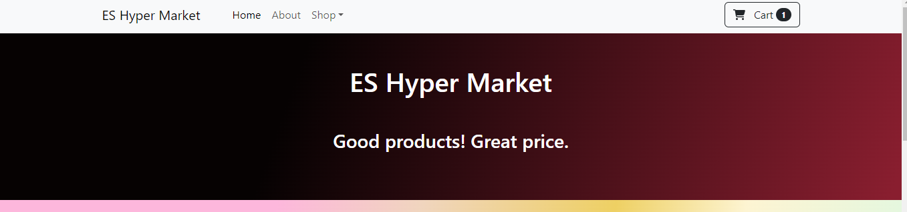
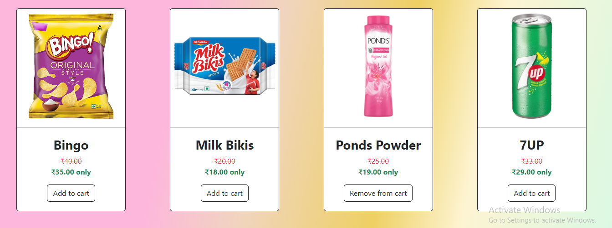
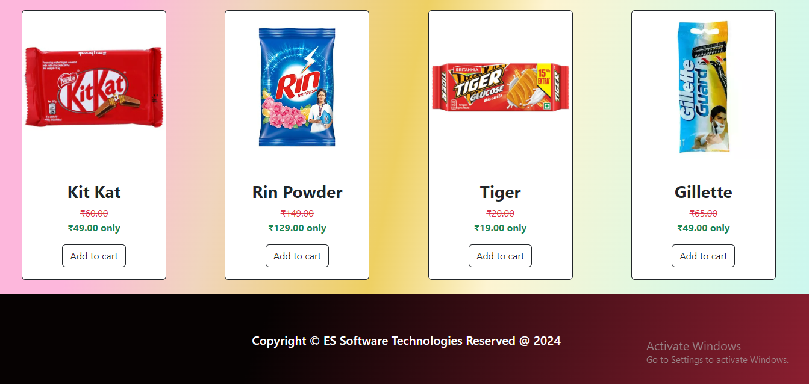

## React- Day -3: React hooks & states   

**React Shopping cart task**   

 - I have completed and submitted Shopping cart task, kindly check and verify it.   

 - I completed this task using react

  **Technology used:**   

 - React JS

 **Task URL:**  https://app-shoppingcart.netlify.app/

 ## Installation steps:

1. Clone the repository (or) Download the projects:

    ``` bash

    git clone https://github.com/EsakkiRajM/React-Projects.git

    ```

2. Navigate to the project directory:

    ```bash
    cd Your-Project-Foldername
    ```

3. Install dependencies:

   Use the following commands to get a node_modules libs

    ```bash
    npm install
    ```

4. Run the project:

    Run the following commands to see the output

    ```bash
    npm run dev
    ```

    

- I have attached `Output image` for your reference  

   **Output:**

 
 
 


