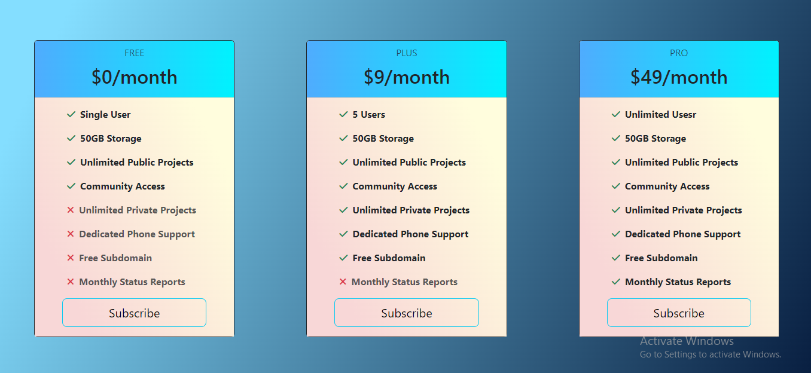

## React- Day -2: React   

**React Price card task**   

 - I have completed and submitted React Price card task, kindly check and verify it.   

 - I completed this task using react

  **Technology used:**   

 - React JS

 **Task URL:**  https://userpricecards.netlify.app/

 ## Installation steps:

    1. Clone the repository (or) Download the projects:

    ```sh
    git clone https://github.com/EsakkiRajM/React-Projects.git
    ```    

    2. Open the terminal and change the project path:   
    - `cd project-name`   

    3. Run the following commands:

    ```
    npm install
    ```

    ```
    npm run dev
    ```
    

- I have attached `Output image` for your reference  

   **Output:**

 


